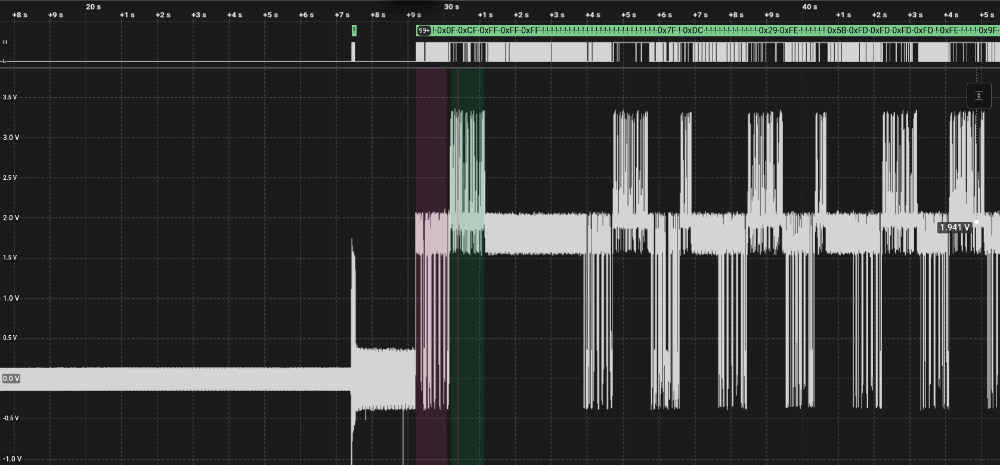
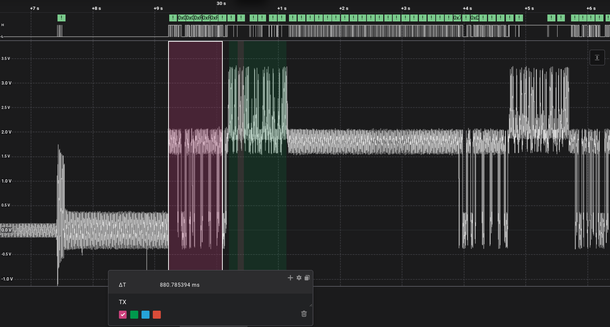

# Important disclaimer

> ⚠️ ⚠️ ⚠️ **WARNING**⚠️ ⚠️ ⚠️ 
>
> 1. **SAFETY**: this happens at `~50Vdc` and quite near to `230Vac` **THERE IS ELECTROCUTION RISKS**. You need to know what you are doing: **IF YOU ARE UNSURE, STOP NOW**
> 2. This is done by only observing/studying, and using information publicly available
> 3. You might break your HVAC or null your warranty

## Description

Trying to understand how Mitsubishi Electric air conditioning units (`MXZ-2F53` and `SEZ-M25`) are communicating via `TB3`. This is restricted to `TB3` (`S1`, `S2`, `S3` in green), which was more *interesting*. There are other digital channels also: `CN105`, `CN99` (in orange):

A lot about `CN105`, `CN99` is covered in the following:

* <https://github.com/LenShustek/M-NET-Sniffer>
* <https://github.com/SwiCago/HeatPump.git>
* <https://github.com/Jetblack31/P1P2Serial.git>

`TB3` is not only more interesting (different than simple serial lines), but it has the advantage to be easily accessible via the external unit terminals, especially in case you have a ducted AC.

### Electrical

`TB3` carries power (`S1: L, S2: N`) and data (`S2: GND`, `S3: data`).

Connected the scope (battery, no power socket to avoid issues to differential line, if any): `GND->S2, ProbeA->S3`. Voltage level peak-2-peak is about `40V`. There seems to be two different zones (TX, RX?), one higher `~22-40V`, one lower `~0-22V`. Lower seems to be serial balanced at about `~80bps`; higher has a *strange* shape with interrupted `50Hz` waves. It looks like a AC (50Hz) signal with super imposed serial data.

Assuming it could be some differential lines, and having not differential probe at reach, I connected with **battery only** instruments, with **no connection to power lines** to avoid ground loops and over-voltage on common mode.

In order to use the logic analyzer, I utilized a `2MOhm` `1/10` resistive divider (`2M`, `200k`) between `S3` and `S2`, reducing then voltages to `0-5V`. A differential probe would be best. Also, the better approach of using 2 probes and look at the difference, to avoid unbalancing/interfering with the line is not needed at this low speed.

### Logical

The logic analyzer allowed to record a power cycle, which looks like this:

From timing consideration, I will call TX the higher part, which happens first, RX (receive) the higher part:

#### TX

It seems to be serial frames at `12ms` bit duration (`83bps`), coded `8E1`.

Despite `8E1` provides best error free configuration, there is still some periodic framing errors, see `!`:

These errors seem to occur systematically at end of packets of 6 bytes: assuming a `8E1` frame configuration, the stop bit of the 6th byte is low instead of high, resulting in a frameing error. It could be some kind of `ACK` mechanism (similar to I2C) where the receiver pulls down to acknoledge the reception:

#### RX

During RX, 50Hz waves increased amplitude. There is cases where RX phase lasts shorter or longer intervals.

At specific time intervals, the line shows discontinuities, which lets me think about some kind of serial or bipolar encoding.

All frames seem to be composed by:

1. Header `H`: a `100ms` initial header, with `H1`: `25ms` down, `H2`: `75ms` up
2. Data `D`: e certain number (`11` short, `66` long) sequence of `12ms` intervals where voltage is either above or below a `~20V` threshold
3. Footer `F`: a `200ms` final footer, `F1`: `100ms` up, `F2`: `100ms` down

